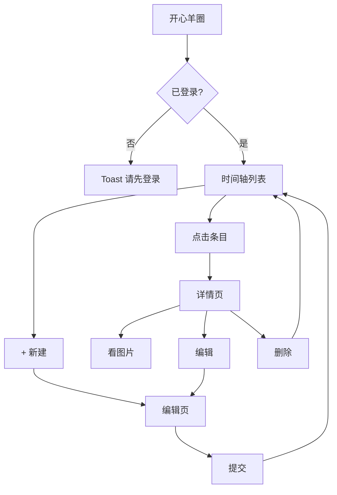

# 牙套日记 · 开发 PRD

**版本**：v1.1  
**模块**：开心羊圈 → 牙套日记  
**用途**：供 AI / 开发直接实现  

---

## 1. 功能概述

在「开心羊圈」新增「牙套日记」功能。用户可创建、查看、编辑、删除自己的正畸记录。

**单条记录字段**：

- 文字（可选）
- 图片（可选，多张）
- 发生时间（必填）
- 心情（必填）

**查看方式**：时间轴列表，按发生时间倒序；列表不展示图片；点击进入详情页才看图片。

**约束**：

- 需登录后使用
- 不关联积分
- 记录仅本人可见

---

## 2. 页面与路由

| 页面 | 路径 | 说明 |
|------|------|------|
| 时间轴列表 | `pages/sheep-circle/brace-diary/index` | 主入口 |
| 新建/编辑 | `pages/sheep-circle/brace-diary/edit` | 共用表单，`id` 有值为编辑 |
| 记录详情 | `pages/sheep-circle/brace-diary/detail` | 查看完整内容与图片 |

**入口**：在 `pages/sheep-circle/index` 功能网格新增一项：

```js
{ name: '牙套日记', emoji: '🦷', desc: '记录正畸每一天', type: 'brace-diary', color: 'blue' }
```

点击 `type === 'brace-diary'` 时：

- 未登录 → Toast「请先登录」
- 已登录 → `navigateTo` 列表页

登录态复用现有 `alvey_logged_in`（`wx.getStorageSync`）。

`app.json` 需注册以上 3 个页面。

---

## 3. 页面规格

### 3.1 时间轴列表页

**布局**：

- 导航栏标题：「牙套日记」
- 右上角「+」→ 新建页

**列表项展示**（每条）：

- 发生时间（日期 + 时间）
- 心情（emoji + 文字）
- 文字摘要（最多 2 行，超出省略）
- 图片提示：有图显示「📷 N 张」，无图显示「无图片」
- **禁止展示任何图片缩略图**

**排序**：按 `eventTime` 倒序（新的在上）

**样式**：左侧竖线 + 圆点，时间轴视觉

**交互**：

- 点击条目 → 详情页
- 下拉刷新

**空态**：「还没有日记，记录你的第一条牙套故事吧」+「立即记录」按钮

---

### 3.2 新建 / 编辑页

**表单字段**：

| 字段 | 必填 | 规则 |
|------|------|------|
| 发生时间 | 是 | 默认当前时间，可选日期+时间，精确到分钟 |
| 心情 | 是 | 单选 |
| 文字 | 否 | 多行，最多 500 字 |
| 图片 | 否 | 最多 9 张，相册/拍照 |

**心情选项**（固定）：

| key | 展示 |
|-----|------|
| `happy` | 😊 开心 |
| `normal` | 😐 一般 |
| `uncomfortable` | 😣 不适 |
| `tired` | 😴 疲惫 |
| `excited` | 🤩 期待 |
| `annoyed` | 😤 烦躁 |

**提交校验**：

- 心情必选
- 文字与图片至少填一项，否则不可提交

**图片**：

- 选图后本地预览
- 提交时上传，复用现有 `/api/upload`
- 编辑时可删旧图、增新图

**提交成功**：Toast「保存成功」→ 返回列表并刷新  
**提交失败**：Toast「保存失败，请重试」

---

### 3.3 详情页

**展示**：

- 发生时间（完整）
- 心情（emoji + 文字）
- 文字全文
- 图片网格（仅详情页展示）
- 图片点击 → `wx.previewImage` 全屏预览
- 底部小字：「记录于 {createdAt}」（可选）

**操作**：

- 右上角「编辑」→ 编辑页（带 `id`）
- 「删除记录」→ 二次确认 → 删除 → 返回列表

---

## 4. 业务规则

1. 记录私有，仅创建者可 CRUD
2. 列表接口不返回图片 URL，只返回 `imageCount`
3. 详情接口返回完整 `images[]`
4. 允许补录：`eventTime` 可早于 `createdAt`
5. `eventTime` 不得晚于当前时间 + 1 天
6. 单张图片 ≤ 5MB，格式 jpg / png / webp
7. 不涉及积分增减

---

## 5. 接口定义

请求方式与现有项目一致：`utils/api.js` 的 `request()`，Header 带 `X-WX-OPENID`。

### 5.1 列表

```
GET /api/brace-diary/list
```

```json
{
  "code": 0,
  "data": {
    "list": [
      {
        "_id": "xxx",
        "eventTime": "2026-06-28T14:30:00.000Z",
        "mood": "happy",
        "moodLabel": "开心",
        "content": "今天换了第 8 副牙套…",
        "imageCount": 2,
        "createdAt": "2026-06-28T15:02:00.000Z"
      }
    ]
  }
}
```

### 5.2 详情

```
GET /api/brace-diary/detail?id=xxx
```

```json
{
  "code": 0,
  "data": {
    "_id": "xxx",
    "eventTime": "2026-06-28T14:30:00.000Z",
    "mood": "happy",
    "moodLabel": "开心",
    "content": "完整文字…",
    "images": ["https://...", "https://..."],
    "createdAt": "2026-06-28T15:02:00.000Z",
    "updatedAt": "2026-06-28T15:02:00.000Z"
  }
}
```

### 5.3 创建

```
POST /api/brace-diary/create
Body: { "eventTime", "mood", "content", "images": [] }
```

### 5.4 更新

```
POST /api/brace-diary/update
Body: { "_id", "eventTime", "mood", "content", "images": [] }
```

### 5.5 删除

```
POST /api/brace-diary/delete
Body: { "_id": "xxx" }
```

### 5.6 数据模型

| 字段 | 类型 | 说明 |
|------|------|------|
| `_id` | string | 记录 ID |
| `openid` | string | 所属用户 |
| `eventTime` | datetime | 发生时间，排序字段 |
| `mood` | string | happy / normal / uncomfortable / tired / excited / annoyed |
| `content` | string | 0–500 字 |
| `images` | string[] | 图片 URL，最多 9 张 |
| `createdAt` | datetime | 创建时间 |
| `updatedAt` | datetime | 更新时间 |

---

## 6. 前端实现清单

**小程序**：

- [ ] `app.json` 注册 3 个页面
- [ ] `sheep-circle/index` 添加入口与跳转
- [ ] `utils/api.js` 新增：`getBraceDiaryList`、`getBraceDiaryDetail`、`createBraceDiary`、`updateBraceDiary`、`deleteBraceDiary`
- [ ] 列表页：时间轴 UI、下拉刷新、空态
- [ ] 编辑页：表单、心情选择、时间选择、图片上传
- [ ] 详情页：全文 + 图片预览、编辑/删除

**后端**（若在本仓库外）：

- [ ] 5 个 API 接口
- [ ] 按 openid 隔离数据
- [ ] 列表不返回 images，只返回 imageCount

**UI**：与开心羊圈其他子页风格一致，可复用 TDesign 组件。

---

## 7. 流程



---

## 8. 验收标准

- [ ] 开心羊圈有「牙套日记」入口，未登录有提示
- [ ] 可新建记录：发生时间 + 心情必填；文字/图片至少一项
- [ ] 列表按发生时间倒序，时间轴样式，**无任何图片展示**
- [ ] 有图时列表仅显示「📷 N 张」
- [ ] 详情页可看全文和图片，图片可全屏预览
- [ ] 可编辑、删除自己的记录
- [ ] 用户只能看到自己的记录
- [ ] 不涉及任何积分逻辑

---

## 9. 本期不做

- 积分联动
- 公开分享、评论、点赞
- 视频
- 管理后台
- 数据导出
- 换牙套/复诊提醒
- 列表展示图片（含缩略图、封面）
