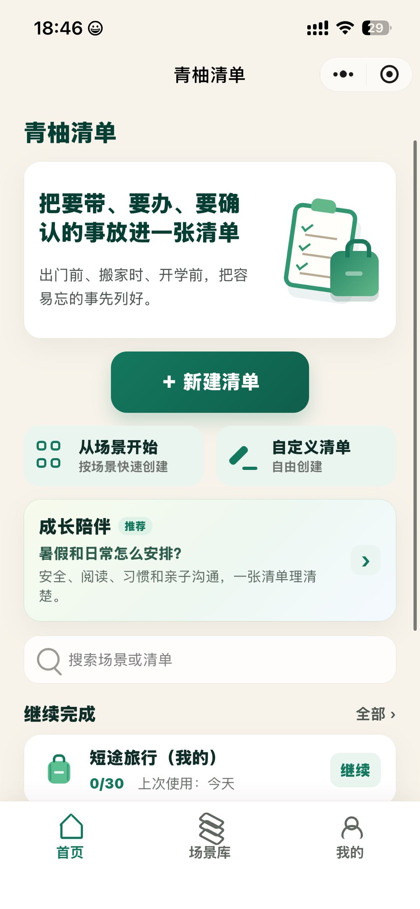
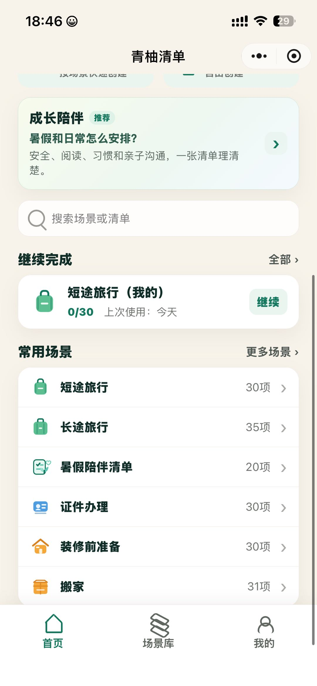
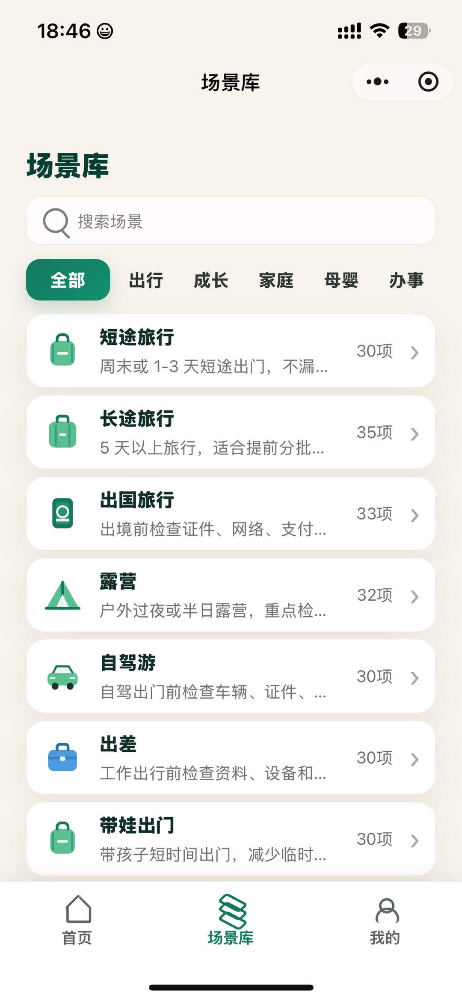
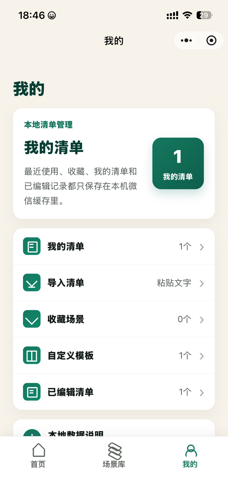
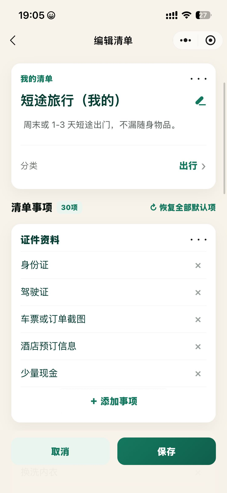
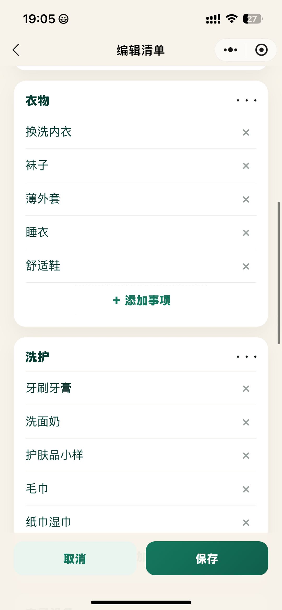
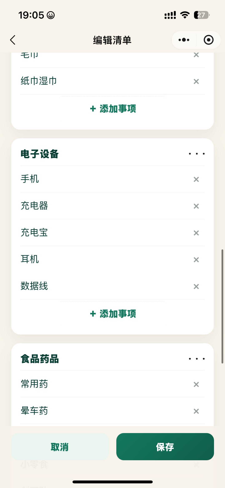
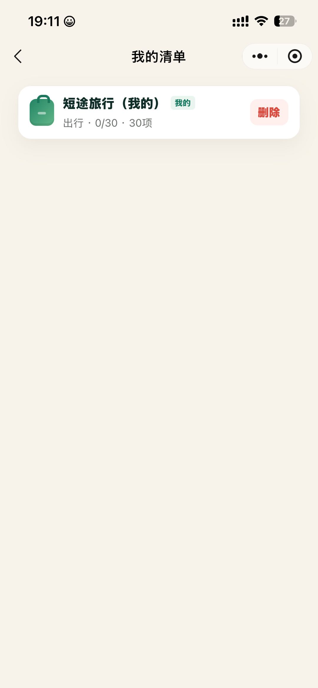
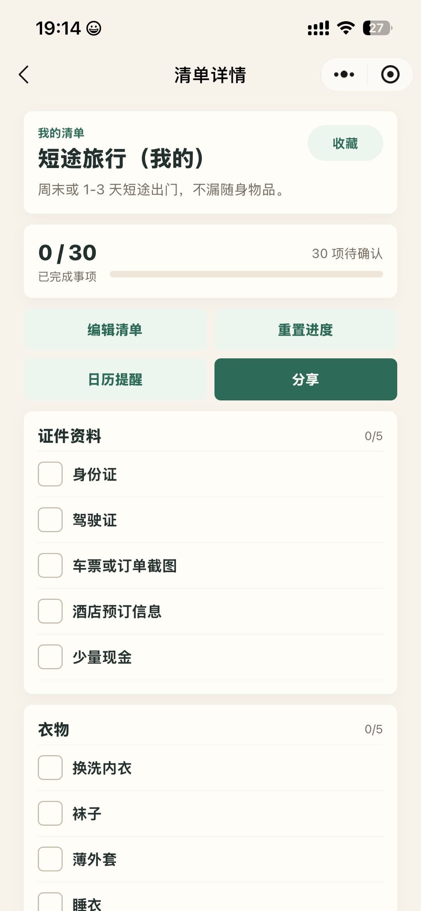

# 羊羊清单 · 产品功能 PRD（标准版）

| 项目 | 内容 |
|------|------|
| 文档版本 | v1.0 |
| 产品名称 | 羊羊清单 |
| 平台 | 微信小程序 |
| 文档状态 | 待评审 |
| 数据策略 | 纯本地存储，无需登录 |

---

## 0. 界面设计参考

> 以下截图为 v1.0 界面设计参考。品牌名统一为 **「羊羊清单」**；首页 **不含** 推荐/运营位；「我的」页 **不含** 导入清单入口。

### 0.1 首页 · Hero 与新建区



| 标注 | 说明 |
|------|------|
| ① | 顶部品牌区：「羊羊清单」 |
| ② | Hero 大卡片：产品价值说明 + 插画（**始终展示**） |
| ③ | 主按钮「+ 新建清单」 |
| ④ | 快捷入口：「从场景开始」「自定义清单」 |
| ⑤ | 搜索框：「搜索场景或清单」 |
| ⑥ | 「继续完成」：进行中清单 + 进度 + 继续按钮 |
| ❌ | **不做** 推荐/运营 Banner（如「成长陪伴」） |

---

### 0.2 首页 · 常用场景（下滑态）



| 标注 | 说明 |
|------|------|
| ① | 搜索 + 「继续完成」区域（同 0.1） |
| ② | 「常用场景」列表，展示场景名 + 条目数 |
| ③ | 「更多场景 >」跳转场景库 Tab |
| ④ | 点击任一场景 → **直接生成副本** → 进入清单详情 |

> **布局说明：** Hero 大卡片 + 新建区在页面上方（见 0.1），用户下滑后可见常用场景列表（见 0.2）。两者同属首页，v1.0 **同时保留**。

---

### 0.3 场景库



| 标注 | 说明 |
|------|------|
| ① | 页标题「场景库」 |
| ② | 搜索框：「搜索场景」 |
| ③ | 分类 Tab：全部 / 出行 / 成长 / 家庭 / 母婴 / 办事 |
| ④ | 场景卡片：图标 + 标题 + 描述 + 条目数 + 箭头 |
| ⑤ | 点击卡片 → **直接生成「我的清单」副本** |

---

### 0.4 我的



| 标注 | 说明 |
|------|------|
| ① | 「本地清单管理」说明卡片 + 清单数量角标 |
| ② | 我的清单 / 收藏场景 / 自定义模板 / 已编辑清单 |
| ③ | 「本地数据说明」入口 |
| ❌ | **不做**「导入清单」功能（参考稿中如有该入口，v1.0 移除） |

---

### 0.5 编辑清单页（短途旅行模板）








| 标注 | 说明 |
|------|------|
| ① | 清单信息卡：标题、描述、分类 |
| ② | 「清单事项 30项」+「恢复全部默认项」 |
| ③ | 分组卡片：组名、条目、删除、组内添加 |
| ④ | 「+ 添加分组」 |
| ⑤ | 底栏「取消」「保存」 |

---

### 0.6 我的清单列表



| 标注 | 说明 |
|------|------|
| ① | 顶栏：返回 + 标题「我的清单」 |
| ② | 清单卡片：左侧场景图标 |
| ③ | 标题 + 「我的」标签 |
| ④ | 副文案：`{分类} · {已完成}/{总数} · {总数}项`（如「出行 · 0/30 · 30项」） |
| ⑤ | 右侧「删除」按钮（红色） |
| ⑥ | 点击卡片主体 → 进入 **清单详情页**（勾选使用） |

---

### 0.7 清单详情页



| 标注 | 说明 |
|------|------|
| ① | 顶栏：返回 + 标题「清单详情」 |
| ② | 信息卡片：标签「我的清单」+ 标题 + 描述 + 右上角「收藏」 |
| ③ | 进度卡片：`0 / 30`、「已完成事项」、「N 项待确认」、进度条 |
| ④ | 快捷操作区（2×2）：编辑清单 / 重置进度 / 日历提醒 / 分享 |
| ⑤ | 分组清单：组名 + 组内进度（如 0/5）+ 勾选框条目列表 |
| ❌ v1.0 不做 | 「日历提醒」「分享」按钮 **不展示**（设计稿保留供后续版本参考） |

---

## 1. 背景与目标

### 1.1 背景

日常生活中，用户在出行、搬家、开学、办事等场景下，容易遗漏「要带、要办、要确认」的事项。通用 Todo 工具偏任务管理，缺少场景化模板与「一张清单理清楚」的体验。

### 1.2 产品定位

**羊羊清单** 是一款面向个人用户的场景化清单小程序：提供预设场景模板，也支持自定义清单；用户可勾选进度、分组管理、添加备注，并在首页快速继续未完成清单。

### 1.3 产品目标（v1.0）

| 目标 | 说明 |
|------|------|
| 降低创建成本 | 从场景一键生成清单副本，30 秒内可用 |
| 提升完成率 | 首页「继续完成」+ 进度可视化（如 12/30） |
| 零门槛使用 | 无需登录，打开即用 |
| 本地可控 | 数据存本机微信缓存，用户可理解、可管理 |

### 1.4 成功指标（建议）

- 新用户首次创建清单成功率 ≥ 90%
- 7 日内回访继续完成率 ≥ 30%（本地统计）
- 场景模板使用率 ≥ 60%（相对自定义创建）

---

## 2. 目标用户与典型场景

### 2.1 目标用户

- 个人用户：需要出行、办事、生活筹备清单的微信用户
- 扩展场景：家庭、亲子、母婴相关清单（场景库已预留分类）

### 2.2 典型场景

| 场景 | 用户行为 |
|------|----------|
| 周末短途出行 | 从「短途旅行」生成副本 → 勾选行李 → 出发前核对 |
| 搬家筹备 | 从「搬家」模板创建 → 按分组逐项完成 |
| 临时事项 | 自定义空白清单 → 手动添加条目 |
| 再次使用 | 首页「继续完成」→ 进入上次清单 |

---

## 3. 产品范围

### 3.1 v1.0 包含

- 首页（Hero + 新建 + 搜索 + 继续完成 + 常用场景）
- 场景库（分类浏览 + 搜索 + 一键创建副本）
- 我的（本地清单管理、收藏、自定义模板、已编辑清单）
- 清单详情页（勾选使用）+ 编辑清单页（结构调整）
- 清单创建（从场景 / 自定义）
- 本地数据存储与说明
- **公共模板 v1 仅上线「短途旅行」**（其余场景后续版本补充）

### 3.2 v1.0 明确不做

- 微信登录 / 账号体系 / 云端同步
- 推荐 / 运营位
- **导入清单**（粘贴文字导入）
- 分享、协作、多人编辑
- 消息推送、提醒闹钟
- 后台运营管理系统（场景数据 v1 内置）
- **除「短途旅行」外的其余 9 个公共模板**（v1.0 不做，场景库可先只展示短途旅行或隐藏未上线项）

---

## 4. 信息架构

```
羊羊清单
├── 首页
│   ├── Hero 引导区
│   ├── + 新建清单
│   ├── 从场景开始 / 自定义清单
│   ├── 搜索（场景或清单）
│   ├── 继续完成
│   └── 常用场景
├── 场景库
│   ├── 搜索场景
│   ├── 分类 Tab
│   └── 场景列表
└── 我的
    ├── 本地清单管理概览
    ├── 我的清单          → 清单列表页（§0.6）
    ├── 收藏场景
    ├── 自定义模板
    ├── 已编辑清单
    └── 本地数据说明

清单详情页（独立页面，非 Tab）
编辑清单页（独立页面，从详情页进入）
```

**底部 Tab：** 首页 | 场景库 | 我的

---

## 5. 用户故事

| ID | 角色 | 故事 | 优先级 |
|----|------|------|--------|
| US-01 | 用户 | 打开小程序即可使用，无需登录 | P0 |
| US-02 | 用户 | 在首页看到引导文案，知道产品能做什么 | P0 |
| US-03 | 用户 | 点击「+ 新建清单」快速选择创建方式 | P0 |
| US-04 | 用户 | 从场景库选模板，直接生成我的清单副本 | P0 |
| US-05 | 用户 | 创建空白自定义清单并自由编辑 | P0 |
| US-06 | 用户 | 在清单中勾选、增删、排序条目 | P0 |
| US-07 | 用户 | 对条目分组、写备注 | P0 |
| US-08 | 用户 | 修改清单标题 | P0 |
| US-09 | 用户 | 在首页看到进行中清单并一键继续 | P0 |
| US-10 | 用户 | 搜索场景或已有清单 | P1 |
| US-11 | 用户 | 收藏常用场景，便于下次使用 | P1 |
| US-12 | 用户 | 将编辑过的清单存为自定义模板 | P1 |
| US-13 | 用户 | 在「我的」查看、管理全部本地清单 | P0 |
| US-14 | 用户 | 了解数据仅保存在本机 | P0 |

---

## 6. 功能详细说明

### 6.1 首页

> 界面参考：见 **§0.1、§0.2**

#### 6.1.1 顶部品牌区

- 展示产品名：**羊羊清单**

#### 6.1.2 Hero 大卡片（始终展示）

- **主文案：** 把要带、要办、要确认的事放进一张清单
- **副文案：** 出门前、搬家时、开学前，把容易忘的事先列好
- **配图：** 清单 + 行李箱类插画

#### 6.1.3 新建清单区

| 元素 | 行为 |
|------|------|
| **+ 新建清单** | 弹出/跳转创建选择：从场景开始 / 自定义清单 |
| **从场景开始** | 跳转场景库 Tab |
| **自定义清单** | 创建空白清单 → 进入详情页 |

#### 6.1.4 搜索

- Placeholder：**搜索场景或清单**
- 搜索范围：内置场景模板 + 用户已创建的清单（标题匹配）
- 点击场景 → 直接生成副本并进入 **清单详情页**
- 点击清单 → 进入该清单 **清单详情页**

#### 6.1.5 继续完成

- 展示最近使用的**未完成**清单（按 `lastUsedAt` 倒序）
- 单条：图标、标题、进度（如 0/30）、上次使用时间、「继续」按钮
- 标题格式：`短途旅行（我的）`
- 默认展示 1～3 条；「全部 >」→ **我的清单列表页**（§0.6）
- 点击「继续」→ **清单详情页**（勾选使用，非编辑页）

#### 6.1.6 常用场景

- 展示高频场景及条目数
- 点击 → 直接生成副本 → 进入 **清单详情页**
- 「更多场景 >」→ 场景库 Tab
- v1.0 常用场景仅展示 **短途旅行**（与已上线公共模板一致）

---

### 6.2 场景库

> 界面参考：见 **§0.3**

- 页标题、搜索、分类 Tab、场景卡片列表
- 点击场景卡片 → **直接生成副本**（勾选状态为空）→ 进入 **清单详情页**

**v1.0 已上线公共模板：**

| 场景 | 分类 | 条目数 | 状态 |
|------|------|--------|------|
| 短途旅行 | 出行 | 30 | ✅ v1.0 上线 |

> 完整分组与条目见 **附录 A**。其余场景（长途旅行、露营、搬家等）**v1.0 不做**，场景库 v1 可仅展示「短途旅行」，或展示但标记「即将上线」且不可点击。

---

### 6.3 清单详情页（勾选使用）

> 界面参考：见 **§0.7**。与 **编辑清单页（§6.4）为两个独立页面**。首页「继续」、我的清单列表点击卡片、从场景创建完成后，均进入本页。

#### 6.3.1 页面定位

用户在此页 **勾选完成事项、查看进度**，是日常使用的主页面。

#### 6.3.2 页面结构

| 区域 | 元素 | 说明 |
|------|------|------|
| 顶栏 | 返回 + 标题 | 标题固定为「**清单详情**」 |
| 信息卡片 | 标签 | 小字绿色「我的清单」 |
| 信息卡片 | 清单标题 | 大号加粗，如「短途旅行（我的）」 |
| 信息卡片 | 描述 | 一行灰色说明，如「周末或 1-3 天短途出门，不漏随身物品。」 |
| 信息卡片 | 收藏 | 右上角浅绿按钮「收藏」；见 §6.3.3 |
| 进度卡片 | 完成数 | 大号「`{已完成} / {总数}`」，如「0 / 30」 |
| 进度卡片 | 文案 | 左「已完成事项」；右「`{待确认数}` 项待确认」 |
| 进度卡片 | 进度条 | 横向进度条，随勾选实时更新 |
| 快捷操作 | 编辑清单 | 浅绿按钮 → 跳转 **编辑清单页（§6.4）** |
| 快捷操作 | 重置进度 | 浅绿按钮 → 清空全部勾选状态，二次确认 |
| 快捷操作 | 日历提醒 | 设计稿有；**v1.0 不展示** |
| 快捷操作 | 分享 | 设计稿有；**v1.0 不展示** |
| 清单内容 | 分组卡片 | 组名 + 右上角组内进度（如「0/5」） |
| 清单内容 | 条目行 | 左侧 **方形勾选框** + 条目文字 |
| 清单内容 | 备注 | 有备注时展示小图标，点击可查看（只读） |

> v1.0 快捷操作区仅展示 **「编辑清单」「重置进度」** 两个按钮，横向排列或 1×2 布局均可。

#### 6.3.3 交互说明

| 操作 | 行为 |
|------|------|
| 勾选 / 取消勾选 | 更新条目 `completed`、总进度、组内进度、进度条；debounce 写入本地；更新 `lastUsedAt` |
| 收藏 | 若清单来自公共场景（有 `sourceScenarioId`），切换该场景收藏状态；已收藏则取消。自定义清单无来源场景时 **隐藏**「收藏」按钮 |
| 编辑清单 | 进入编辑清单页（§6.4）；保存后返回本页，结构/文案更新，勾选状态保留 |
| 重置进度 | 二次确认后，将所有条目 `completed` 置为 `false`，不改动清单结构 |
| 返回 | 回到上一页（首页 / 我的清单列表） |

#### 6.3.4 与编辑页的分工

| 能力 | 清单详情页 | 编辑清单页 |
|------|------------|------------|
| 勾选完成 | ✅ | ❌ |
| 查看进度 | ✅ | ❌ |
| 增删改条目 / 分组 | ❌ | ✅ |
| 改标题 / 描述 / 分类 | ❌ | ✅ |
| 恢复全部默认项 | ❌ | ✅ |
| 重置进度（仅清空勾选） | ✅ | ❌ |
| 存为自定义模板 | ❌ | ✅ |

---

### 6.4 编辑清单页（结构调整）

> 界面参考：见 **§0.5**；公共模板初始内容见 **附录 A**。从清单详情页「**编辑清单**」按钮进入。

#### 6.4.1 编辑清单页 UI 规范

| 区域 | 元素 | 说明 |
|------|------|------|
| 顶栏 | 返回 + 标题 | 标题固定为「编辑清单」 |
| 信息卡片 | 标签 | 小字绿色「我的清单」 |
| 信息卡片 | 清单标题 | 大号加粗，如「短途旅行（我的）」；右侧铅笔图标可编辑 |
| 信息卡片 | 描述 | 一行灰色说明文案 |
| 信息卡片 | 分类 | 「分类」行，展示所属分类（如「出行 >」），可点击切换 |
| 事项区顶栏 | 统计 + 操作 | 左「清单事项 N项」；右「恢复全部默认项」（带刷新图标） |
| 分组卡片 | 分组标题 | 加粗组名 + 右侧「···」菜单（重命名/删除分组） |
| 分组卡片 | 条目行 | 条目文字 + 右侧「×」删除 |
| 分组卡片 | 添加条目 | 组内底部「+ 添加事项」（绿色文字） |
| 页面底部 | 添加分组 | 虚线框「+ 添加分组」 |
| 底栏 | 取消 / 保存 | 左浅绿「取消」；右深绿「保存」 |

**交互说明：**

- 「恢复全部默认项」：将当前清单内容重置为公共模板初始状态（分组 + 条目 + 默认文案），勾选状态清空；需二次确认。
- 「保存」：持久化标题、描述、分类、分组与条目变更，写入本地；更新 `isEdited = true`。
- 「取消」：放弃本次未保存修改，返回上一页（若有未保存变更需提示）。
- 删除条目 / 分组、添加条目 / 分组：见 §6.4.2 编辑能力。

---

#### 6.4.2 编辑能力（v1 全部必做）

| 能力 | 说明 | 所在页面 |
|------|------|----------|
| 勾选完成 | 点击勾选/取消，进度实时更新 | 清单详情页 |
| 新增条目 | 输入添加，默认归入当前分组 | 编辑清单页 |
| 删除条目 | 编辑态「×」删除，二次确认 | 编辑清单页 |
| 编辑条目 | 修改条目文字 | 编辑清单页 |
| 排序 | 同组内长按拖拽 | 编辑清单页 |
| 分组 | 新建/重命名/删除分组 | 编辑清单页 |
| 备注 | 每条条目可填写纯文本备注 | 编辑清单页 |

#### 6.4.3 清单级操作

- 修改清单标题（编辑清单页）
- 删除整份清单（我的清单列表页「删除」按钮，二次确认）
- 存为自定义模板（编辑清单页，不含勾选状态）

#### 6.4.4 保存策略

| 页面 | 保存方式 |
|------|----------|
| 清单详情页 | 勾选后 debounce 300～500ms 自动保存；更新 `lastUsedAt` |
| 编辑清单页 | 点击「保存」写入；更新 `isEdited = true`、`lastUsedAt` |

---

### 6.5 我的

> 界面参考：见 **§0.4**

| 入口 | 说明 | v1 |
|------|------|-----|
| 我的清单 | 全部用户清单 → 列表页（§0.6、§6.5.1） | ✅ |
| 收藏场景 | 已收藏场景，点击可创建副本 | ✅ |
| 自定义模板 | 用户保存的模板 | ✅ |
| 已编辑清单 | 被修改过的清单筛选视图 | ✅ |
| 本地数据说明 | 存储与清缓存说明 | ✅ |
| ~~导入清单~~ | — | ❌ |

#### 6.5.1 我的清单列表页

> 界面参考：见 **§0.6**

**入口：** 我的 → 我的清单；首页「继续完成」→「全部 >」

**列表项结构：**

| 元素 | 说明 |
|------|------|
| 左侧图标 | 来源场景图标（如行李箱） |
| 标题 | 清单名称，如「短途旅行（我的）」 |
| 标签 | 绿色小标签「我的」 |
| 副文案 | `{分类} · {已完成}/{总数} · {总数}项`，如「出行 · 0/30 · 30项」 |
| 删除 | 右侧红色「删除」按钮，二次确认后移除 |
| 点击卡片 | 进入 **清单详情页**（§6.3） |

**排序：** 按 `lastUsedAt` 倒序

**空状态：** 文案「还没有清单」+ 按钮「从场景开始」

---

## 7. 关键用户流程

### 7.1 从场景创建

```
用户点击「短途旅行」
  → 复制模板为新「我的清单」（新 ID，勾选全 false，写入 defaultSnapshot）
  → 写入本地存储
  → 跳转清单详情页（§6.3）
```

- 同一模板可多次创建
- 默认命名：`{场景名}（我的）`，重名则追加序号

### 7.2 自定义创建

```
用户点击「自定义清单」
  → 创建空清单（含「默认分组」）
  → 跳转清单详情页（§6.3）
```

### 7.3 首页继续完成

```
用户点击「继续」
  → 进入该清单的清单详情页（§6.3）
  → 勾选事项，进度自动保存
```

### 7.4 编辑清单

```
清单详情页 → 点击「编辑清单」
  → 进入编辑清单页（§6.4）
  → 修改结构后「保存」→ 返回清单详情页
  → 点击「取消」→ 放弃未保存修改，返回详情页
```

### 7.5 重置进度

```
清单详情页 → 点击「重置进度」
  → 二次确认
  → 全部条目 completed = false
  → 进度卡片与组内进度归零
```

---

## 8. 数据模型（本地）

### 8.1 场景模板 `ScenarioTemplate`（内置，只读）

```typescript
{
  id: string
  title: string
  description: string
  category: '出行' | '成长' | '家庭' | '母婴' | '办事'
  icon: string
  itemCount: number
  groups: Array<{
    name: string
    items: Array<{ title: string; note?: string }>
  }>
}
```

### 8.2 我的清单 `UserChecklist`

```typescript
{
  id: string
  title: string
  description?: string          // 如「周末或 1-3 天短途出门…」
  category?: string             // 如「出行」
  sourceScenarioId?: string
  sourceTemplateId?: string
  isEdited: boolean             // 编辑页保存后置 true
  defaultSnapshot?: {           // 用于「恢复全部默认项」；来自公共模板或首次创建快照
    title: string
    description?: string
    category?: string
    groups: Array<{ name: string; items: Array<{ title: string; note?: string }> }>
  }
  createdAt: number
  updatedAt: number
  lastUsedAt: number
  groups: Array<{
    id: string
    name: string
    items: Array<{
      id: string
      title: string
      note?: string
      completed: boolean
      sortOrder: number
    }>
  }>
}
```

### 8.3 自定义模板 `CustomTemplate`

```typescript
{
  id: string
  title: string
  description?: string
  category?: string
  createdAt: number
  groups: Array<{
    id: string
    name: string
    items: Array<{ id: string; title: string; note?: string; sortOrder: number }>
  }>
}
```

### 8.4 收藏 `FavoriteScenario`

```typescript
{
  scenarioId: string
  favoritedAt: number
}
```

### 8.5 本地存储结构

```typescript
// key: yangyang_checklists_v1
{
  checklists: UserChecklist[]
  customTemplates: CustomTemplate[]
  favorites: FavoriteScenario[]
}
```

- 使用 `wx.setStorage` / `wx.getStorage`
- 创建副本时：若来自公共模板，同时写入 `defaultSnapshot`（模板初始内容）
- 自定义清单：`defaultSnapshot` 可为首次创建时的空结构快照

### 8.6 页面路由

| 页面 | 路径建议 |
|------|----------|
| 首页 | `/pages/index/index` |
| 场景库 | `/pages/scenarios/index` |
| 我的 | `/pages/mine/index` |
| 我的清单列表 | `/pages/checklist/list` |
| 清单详情页 | `/pages/checklist/detail` |
| 编辑清单页 | `/pages/checklist/edit` |
| 收藏场景 | `/pages/mine/favorites` |
| 自定义模板 | `/pages/mine/templates` |
| 已编辑清单 | `/pages/checklist/edited` |
| 本地数据说明 | `/pages/mine/data-info` |
| 搜索结果 | `/pages/search/index` |

---

## 9. UI 规范

| 元素 | 规范 |
|------|------|
| 背景色 | 浅米白 / 奶油色 |
| 主色 | 深绿色（按钮、Tab 选中态） |
| 卡片 | 白底、大圆角（16～20px）、轻阴影 |
| 品牌名 | 全局使用「羊羊清单」 |

---

## 10. 验收标准

### 10.1 首页

- [ ] 顶部展示「羊羊清单」，无推荐/运营 Banner
- [ ] Hero +「+ 新建清单」始终可见（§0.1）
- [ ] 常用场景列表正确（§0.2）
- [ ] 搜索、继续完成、场景创建流程正常

### 10.2 场景库

- [ ] 界面与 §0.3 一致
- [ ] 分类过滤、搜索、一键创建副本正常

### 10.3 清单详情页

- [ ] 界面与 §0.7 一致
- [ ] 首页「继续」、我的清单点击卡片均进入本页
- [ ] 勾选/取消勾选后总进度、组内进度、进度条即时更新并持久化
- [ ] 「编辑清单」进入编辑页；「重置进度」可清空勾选
- [ ] 「收藏」对来源场景生效；自定义清单隐藏收藏按钮
- [ ] v1.0 **不展示**「日历提醒」「分享」

### 10.4 编辑清单页

- [ ] 编辑页布局与 §0.5、§6.4.1 一致
- [ ] 短途旅行模板内容与附录 A 一致（6 组 30 项）
- [ ] 「恢复全部默认项」功能正常
- [ ] 增删改条目、排序、分组、备注、改标题可用
- [ ] 可存为自定义模板

### 10.5 我的 / 我的清单列表

- [ ] 「我的」页与 §0.4 一致，**无导入清单入口**
- [ ] 我的清单列表与 §0.6 一致（标签、副文案、删除）
- [ ] 本地数据说明准确

### 10.6 场景与模板范围

- [ ] v1.0 仅「短途旅行」可创建副本
- [ ] 其余 9 个公共模板未上线或不可创建

### 10.7 通用

- [ ] 全程无需登录
- [ ] 杀进程后数据不丢失（同设备同微信）
- [ ] 清缓存后数据丢失，说明页有告知

---

## 11. 非功能需求

| 类型 | 要求 |
|------|------|
| 性能 | 首屏 ≤ 2s；列表滚动流畅 |
| 兼容性 | 微信基础库 ≥ 2.20.0 |
| 存储 | 建议单用户清单上限 100 份 |
| 隐私 | 不采集个人身份信息 |

---

## 12. 版本规划

| 版本 | 内容 |
|------|------|
| **v1.0（本期）** | 三 Tab + 完整清单编辑 + 本地存储 |
| v1.1 | 清单分享（只读）、复制清单 |
| v1.2 | 导入清单（粘贴文字） |
| v2.0 | 可选登录 + 云同步 |

---

## 13. 已确认规则

1. **删除分组**：组内条目 **移至「默认分组」**（不一并删除）。
2. **继续完成**：**已完成**（100%）的清单 **不在** 首页「继续完成」展示。
3. **详情 vs 编辑**：勾选在清单详情页；改结构在编辑清单页。
4. **公共模板**：v1.0 仅「短途旅行」上线。
5. **详情页快捷操作**：v1.0 仅「编辑清单」「重置进度」；「日历提醒」「分享」后续版本。

---

## 附录 A：公共模板内容 · 短途旅行

v1.0 首个完整定义的公共场景模板。用户从场景库/首页点击「短途旅行」后，按以下结构生成副本。

### A.1 模板元信息

| 字段 | 内容 |
|------|------|
| id | `scenario_short_trip` |
| 标题 | 短途旅行 |
| 副本默认标题 | 短途旅行（我的） |
| 描述 | 周末或 1-3 天短途出门，不漏随身物品。 |
| 分类 | 出行 |
| 图标 | 行李箱 |
| 条目总数 | **30 项**（6 个分组 × 每组 5 项） |

### A.2 分组与条目清单

#### 分组 1：证件资料

| # | 条目 |
|---|------|
| 1 | 身份证 |
| 2 | 驾驶证 |
| 3 | 车票或订单截图 |
| 4 | 酒店预订信息 |
| 5 | 少量现金 |

#### 分组 2：衣物

| # | 条目 |
|---|------|
| 1 | 换洗内衣 |
| 2 | 袜子 |
| 3 | 薄外套 |
| 4 | 睡衣 |
| 5 | 舒适鞋 |

#### 分组 3：洗护

| # | 条目 |
|---|------|
| 1 | 牙刷牙膏 |
| 2 | 洗面奶 |
| 3 | 护肤品小样 |
| 4 | 毛巾 |
| 5 | 纸巾湿巾 |

#### 分组 4：电子设备

| # | 条目 |
|---|------|
| 1 | 手机 |
| 2 | 充电器 |
| 3 | 充电宝 |
| 4 | 耳机 |
| 5 | 数据线 |

#### 分组 5：食品药品

| # | 条目 |
|---|------|
| 1 | 常用药 |
| 2 | 晕车药 |
| 3 | 水杯 |
| 4 | 小零食 |
| 5 | 创可贴 |

#### 分组 6：工具其他

| # | 条目 |
|---|------|
| 1 | 雨伞 |
| 2 | 背包 |
| 3 | 垃圾袋 |
| 4 | 口罩 |
| 5 | 备用袋子 |

### A.3 内置 JSON 示例（开发可直接引用）

```json
{
  "id": "scenario_short_trip",
  "title": "短途旅行",
  "description": "周末或 1-3 天短途出门，不漏随身物品。",
  "category": "出行",
  "icon": "suitcase",
  "itemCount": 30,
  "groups": [
    {
      "name": "证件资料",
      "items": [
        { "title": "身份证" },
        { "title": "驾驶证" },
        { "title": "车票或订单截图" },
        { "title": "酒店预订信息" },
        { "title": "少量现金" }
      ]
    },
    {
      "name": "衣物",
      "items": [
        { "title": "换洗内衣" },
        { "title": "袜子" },
        { "title": "薄外套" },
        { "title": "睡衣" },
        { "title": "舒适鞋" }
      ]
    },
    {
      "name": "洗护",
      "items": [
        { "title": "牙刷牙膏" },
        { "title": "洗面奶" },
        { "title": "护肤品小样" },
        { "title": "毛巾" },
        { "title": "纸巾湿巾" }
      ]
    },
    {
      "name": "电子设备",
      "items": [
        { "title": "手机" },
        { "title": "充电器" },
        { "title": "充电宝" },
        { "title": "耳机" },
        { "title": "数据线" }
      ]
    },
    {
      "name": "食品药品",
      "items": [
        { "title": "常用药" },
        { "title": "晕车药" },
        { "title": "水杯" },
        { "title": "小零食" },
        { "title": "创可贴" }
      ]
    },
    {
      "name": "工具其他",
      "items": [
        { "title": "雨伞" },
        { "title": "背包" },
        { "title": "垃圾袋" },
        { "title": "口罩" },
        { "title": "备用袋子" }
      ]
    }
  ]
}
```

### A.4 验收要点（短途旅行模板）

- [ ] 创建副本后共 6 组、30 条，分组名与条目文案与上表一致
- [ ] 信息卡展示描述与分类「出行」
- [ ] 「恢复全部默认项」可还原为上述初始内容
- [ ] 编辑页布局与 §0.5、§6.4.1 一致

---

## 附录 B：设计稿文件

| 文件名 | 对应页面 |
|--------|----------|
| `assets/home-hero-create.png` | 首页 · Hero 与新建 |
| `assets/home-common-scenes.png` | 首页 · 常用场景 |
| `assets/scenarios-library.png` | 场景库 |
| `assets/mine-profile.png` | 我的 |
| `assets/edit-checklist-documents.png` | 编辑清单 · 信息区 + 证件资料 |
| `assets/edit-checklist-clothing-care.png` | 编辑清单 · 衣物 + 洗护 |
| `assets/edit-checklist-devices-medicine.png` | 编辑清单 · 电子设备 + 食品药品 |
| `assets/edit-checklist-tools.png` | 编辑清单 · 食品药品 + 工具其他 |
| `assets/my-checklist-list.png` | 我的清单列表页 |
| `assets/checklist-detail.png` | 清单详情页 |
